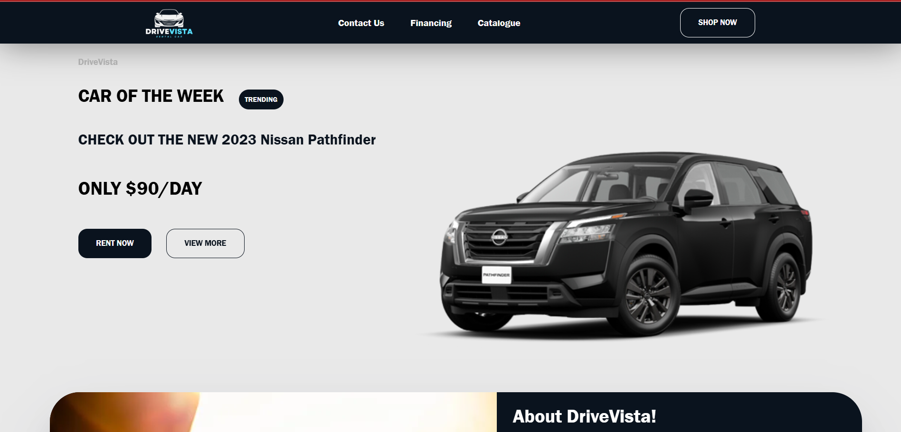

# 🚗 DriveVista — Car Rental Frontend

DriveVista is a **modern, dynamic, and responsive** mock frontend for a car rental platform, built with **React.js**.  
It delivers an industry-level user experience with an interactive UI, adaptive layouts, and component-driven architecture.

##[Live Preview](https://drivevista.netlify.app/)

---

## ✨ Features

- **Dynamic Data Rendering** – Car listings update dynamically with props/state.
- **Responsive Layout** – Fully mobile-friendly, adapting seamlessly to all screen sizes.
- **Interactive Components** – Card-based car displays, filters, and navigation.
- **Scalable Structure** – Modular React components for easy maintenance and extension.
- **Modern Styling** – Styled with CSS modules/Tailwind/App-level styles for a professional look.
- **Clean Codebase** – Organized folder structure following React best practices.

---

## 🛠️ Tech Stack

- **Frontend Framework:** [React.js](https://reactjs.org/)
- **Language:** JavaScript (ES6+)
- **Styling:** CSS Modules / App.css
- **Build Tool:** Create React App (CRA)
- **Version Control:** Git & GitHub

---

## 📂 Project Structure
```
DriveVista/
├── public/
│ ├── index.html
│ └── favicon.ico
├── src/
│ ├── components/
│ │ ├── Header/
│ │ ├── Card/
│ │ ├── List/
│ │ └── Map/
│ ├── api/
│ ├── App.js
│ ├── App.css
│ └── index.js
└── package.json

```

---

## 🚀 Getting Started

Follow these steps to run the project locally:


### 1️⃣ Clone the Repository
```
git clone https://github.com/your-username/DriveVista.git
cd DriveVista
```
### 2️⃣ Install Dependencies
```
npm install
```
### 3️⃣ Start Development Server
```
npm start
```
The app will open at http://localhost:3000.

###  Screenshots
Desktop View


Mobile View


🤝 Contributing
Contributions are welcome!
Please fork the repository and submit a pull request.
